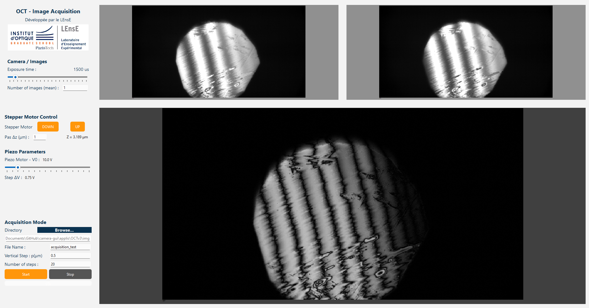

.. OCT GUI documentation master file, created by
   sphinx-quickstart on Fri Dec 15 11:17:25 2023.
   You can adapt this file completely to your liking, but it should at least
   contain the root `toctree` directive.

OCT GUI's documentation
#######################

.. warning::
   This application and its documentation website are still works in progress

**OCT GUI** is a graphical user interface (based on PyQt6) dedicated to **control OCT platform** during labworks
at the Experimental Teaching Laboratory (LEnsE) of the Institut d'Optique Graduate School (IOGS).

	
	View of the interface (Pre-processing mode - Basler version).

The GitHub repository of this project : `OCT GUI <https://github.com/IOGS-LEnsE-ressources/oct-gui>`_

Labworks subject are available at the following addresses `Biophotonics Labs <https://lense.institutoptique.fr/ressources/Annee3/TP_Photonique/S9-2324-BioPhot.pdf>`_.

Main contributors
*****************

This Python/PyQt6 release of the GUI was developed by **Noam CHOPPINET** (Student at Institut d’Optique from 2024 to 2027) during an internship in July 2025.

This release was made under the supervision of **Julien MOREAU** (Professor at Institut d’Optique) and **Julien VILLEMEJANE** (Teacher at Institut d’Optique).

*This GUI is based on an obsolete LabView version, developed by Julien MOREAU (and students).*

Technical support was regularly provided by Thierry AVIGNON (Lead Technical and Operations Engineer at LEnsE / Institut d’Optique).